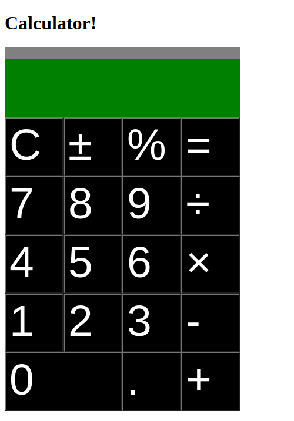

# Calculator
This is a calculator! My first big Javascript project, and what a challenge it was!

**Link to project:** https://www.andyglover.io/odin-calculator/

## How It's Made:

**Tech used:** HTML, CSS, Javascript

Some challenging pieces of this project were:
-The percentage button functionality
-Strings of operations evaluated one after another
-Subsequent presses of the equals button

## Optimizations

There's always more to add to a calculator! Square roots and exponents would be a fun next step.

## Lessons Learned:

I've applied what I've learned from the Odin Project Javascript Foundations course. This project really tested my abilities! I've got plenty still to learn about JavaScript and programming, but I'm proud of my progress!

## Examples:
Here's a few more repositories of mine you might like to check out:

**Admin Dashboard:** https://github.com/andyglover/odin-project-admin-dashboard

**GIF Thingy:** https://github.com/andyglover/gif-thingy

**Library:** https://github.com/andyglover/odin-project-library

**Rock Paper Scissors:** https://github.com/andyglover/odin-rock-paper-scissors

**Tic-Tac-Toe:** https://github.com/andyglover/odin-project-tictactoe